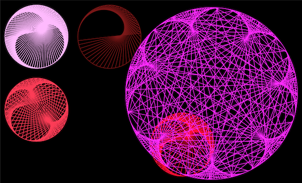

# Cardioid
This is a small P5.js visualisation of some crazy cardioid time table (https://en.wikipedia.org/wiki/Cardioid) inspired by the great code train challenge (https://www.youtube.com/watch?v=bl3nc_a1nvs) 

 

 

## Build
Nothing to build. Just put it on a webserver.

